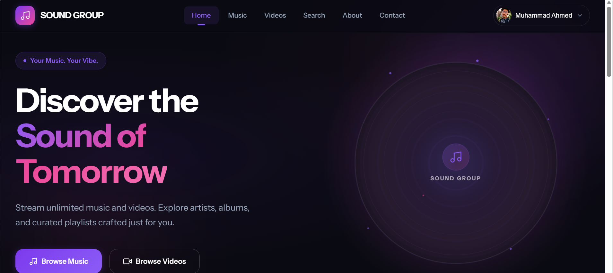
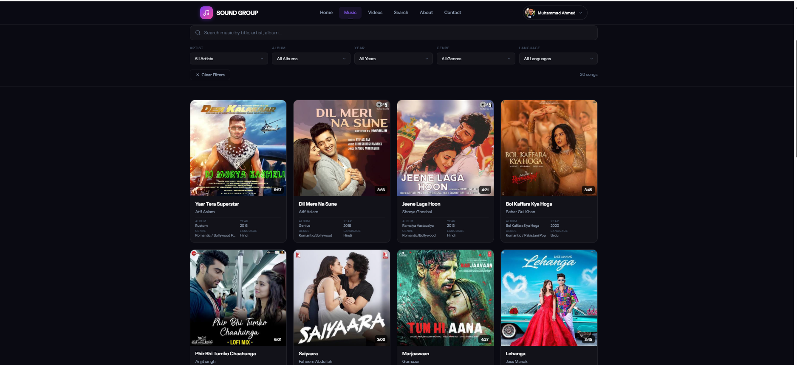
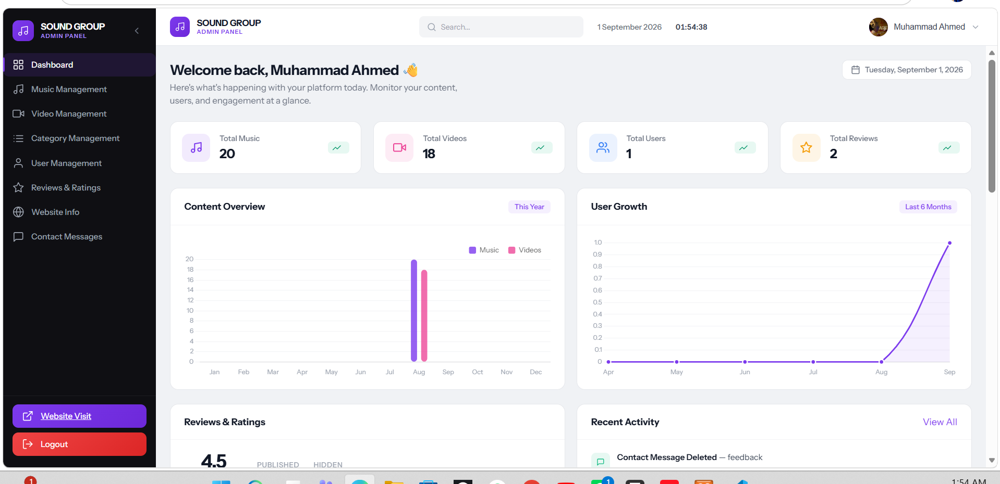
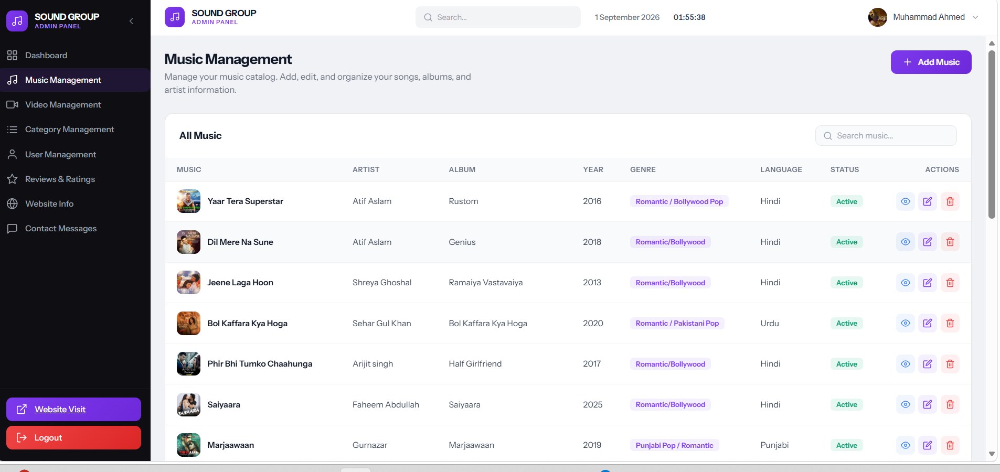
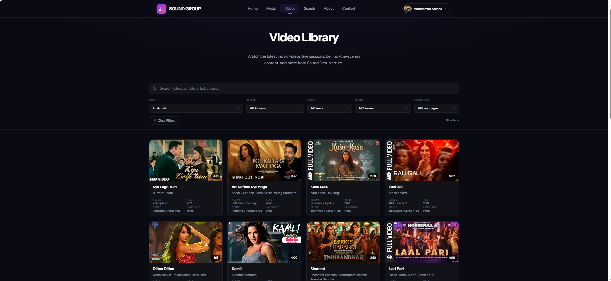

<div align="center">

# 🎵 SOUND Group

**A Full-Stack Music & Video Streaming Platform**

*Explore, stream, and discover music and videos in one unified platform.*

[](https://www.php.net/)
[](https://www.mysql.com/)
[](https://developer.mozilla.org/en-US/docs/Web/HTML)
[](https://developer.mozilla.org/en-US/docs/Web/CSS)
[](https://developer.mozilla.org/en-US/docs/Web/JavaScript)

[Live Demo](#-live-project) • [Report Bug](https://github.com/your-username/sound_management/issues) • [Request Feature](https://github.com/your-username/sound_management/issues)

</div>

---

## 📋 Table of Contents

- [Project Overview](#-project-overview)
- [Technologies Used](#-technologies-used)
- [Website Features](#-website-features)
- [Admin Panel Features](#-admin-panel-features)
- [Media Management](#-media-management)
- [Screenshots](#-screenshots)
- [Live Project](#-live-project)
- [Project Purpose](#-project-purpose)

---

## 🎵 Project Overview

**SOUND Group** is a full-stack music and video streaming platform that allows users to explore, stream, and interact with a curated library of music and video content. Built with PHP and MySQL, the platform offers a modern, responsive interface for both end-users and administrators.

The project consists of two main components:

- **Public Website** — A user-facing platform where visitors can browse, search, stream, and download music and video content.
- **Admin Panel** — A comprehensive back-office system that allows administrators to manage all aspects of the platform including music, videos, users, categories, reviews, and website settings.

---

## 💻 Technologies Used

| Technology | Purpose |
|------------|---------|
| **PHP** | Server-side logic and backend processing |
| **MySQL** | Relational database management |
| **HTML5** | Page structure and semantic markup |
| **CSS3** | Styling, layout, and responsive design |
| **JavaScript** | Client-side interactivity and dynamic behavior |
| **AJAX** | Asynchronous data loading and form submissions |
| **PDO** | Secure database connections and queries |
| **PHPMailer** | Email sending (OTP, password reset, notifications) |
| **Cloudinary** | Cloud-based media upload, storage, and management |

---

## 🖥️ Website Features

### Authentication & User Management
- **User Registration** — Create a new account with email verification
- **User Login/Logout** — Secure session-based authentication
- **User Profile** — View and manage your profile information
- **Password Management** — Change password and email with OTP verification

### Music Features
- **Browse Music** — Explore the full music library with card-based layout
- **Music Details** — View detailed information for each track (artist, album, genre, year, language, duration)
- **Music Playback** — Stream music directly in the browser
- **Music Download** — Download tracks as MP3 files (requires login)

### Video Features
- **Browse Videos** — Explore the video library with thumbnail previews
- **Video Details** — View detailed information for each video
- **Video Playback** — Stream videos directly in the browser
- **Related Videos** — Discover similar content based on artist

### Discovery & Navigation
- **Search** — Full-text search across music and videos
- **About Page** — Learn about the platform and its mission
- **Contact Page** — Send messages directly to the admin team
- **Latest Content** — Homepage showcases the newest music and videos

### Community
- **Reviews & Ratings** — Leave reviews and ratings on music tracks
- **Real-time Notifications** — Get instant feedback on actions via toast notifications

---

## ⚙️ Admin Panel Features

### Authentication & Security
- **Admin Login** — Secure admin authentication
- **OTP Verification** — Two-factor authentication for sensitive actions
- **Password Reset** — Forgot password flow with email-based OTP

### Dashboard
- **Statistics Overview** — Total music, videos, users, and reviews at a glance
- **Content Chart** — Monthly content uploads visualization (music & videos)
- **User Growth Chart** — Cumulative user growth over time
- **Recent Activity Log** — Latest actions performed on the platform

### Music Management
- **View All Music** — Browse, search, and filter the music library
- **Add Music** — Upload new tracks with metadata (artist, album, genre, year, language)
- **Edit Music** — Update track information and files
- **Delete Music** — Remove tracks from the platform
- **Toggle Status** — Activate/deactivate tracks (published/draft)

### Video Management
- **View All Videos** — Browse, search, and filter the video library
- **Add Videos** — Upload new videos with metadata and thumbnails
- **Edit Videos** — Update video information and files
- **Delete Videos** — Remove videos from the platform
- **Toggle Status** — Publish/unpublish videos

### User Management
- **View All Users** — Browse registered users with search and filtering
- **User Details** — View individual user profiles and activity
- **Activate/Deactivate Users** — Enable or disable user accounts
- **Delete Users** — Remove user accounts

### Category Management
- **Artists** — Manage artist names and metadata
- **Albums** — Manage album collections
- **Genres** — Manage music/video genres
- **Languages** — Manage language tags
- **Years** — Manage year/release date categories

### Review Management
- **View All Reviews** — Browse user reviews with search
- **Edit Reviews** — Moderate and update review content
- **Delete Reviews** — Remove inappropriate reviews
- **Toggle Review Status** — Approve/hide reviews

### Contact Messages
- **View Messages** — Read contact form submissions
- **Manage Messages** — Delete or archive messages

### Website Settings
- **Site Information** — Update website name and branding
- **Contact Information** — Manage email, phone, and address
- **Social Media Links** — Configure Facebook, TikTok, LinkedIn, and GitHub URLs

### Admin Profile
- **Profile Management** — Update admin name and avatar
- **Change Password** — Update admin credentials
- **Activity Log** — Track admin actions on the platform

---

## ☁️ Media Management

The platform uses **Cloudinary** for cloud-based media management. All music files, video files, thumbnails, and cover images are uploaded, stored, and served through Cloudinary's CDN infrastructure.

This ensures:
- Fast and reliable media delivery worldwide
- Automatic format optimization and compression
- Scalable storage without server load concerns
- Direct URL-based access for streaming and downloads


---

## 📸 Screenshots

### 1. Website Homepage


### 2. Music Page


### 3. Admin Dashboard


### 4. Music Management


### 5. Video Management



---

## 🔗 Live Project

**Live Demo:** [https://soundgroup.infinityfreeapp.com/frontend/website/index.php]

---

## 🚀 Project Purpose

This project demonstrates practical **full-stack web development** skills including:

- **Frontend Development** — Responsive HTML, CSS, and JavaScript with a modern UI design
- **Backend Development** — PHP-based server logic with MVC-inspired architecture
- **Database Design** — MySQL relational database with normalized tables (artists, albums, genres, languages, years, music, videos, users, reviews, contacts)
- **Authentication** — Session-based user and admin authentication with OTP verification
- **CRUD Operations** — Full Create, Read, Update, and Delete operations across all entities
- **Media Management** — Cloudinary integration for upload, storage, and streaming
- **AJAX** — Asynchronous operations for seamless user experience
- **Email Integration** — PHPMailer for transactional emails (OTP, notifications)
- **Admin Dashboard** — Data visualization with charts and activity logging

---

## 📁 Project Structure

```
sound_management/
├── backend/
│   ├── config/           # Database and app configuration
│   ├── database/         # Database schema and migrations
│   ├── error-handling/   # Error handling utilities
│   ├── handlers/         # PHP action handlers (AJAX endpoints)
│   ├── helpers/          # Helper functions
│   ├── includes/         # Shared includes (auth, db, session)
│   ├── mail/             # PHPMailer email templates
│   └── tools/            # Utility scripts
├── frontend/
│   ├── admin/            # Admin panel pages and assets
│   └── website/          # Public-facing website pages and assets
├── vendor/               # Composer dependencies
├── .env.example          # Environment variables template
├── composer.json         # PHP dependencies
└── index.php             # Root entry point
```

---

## 🛠️ Setup & Installation

1. **Clone the repository**
   ```bash
   git clone https://github.com/your-username/sound_management.git
   cd sound_management
   ```

2. **Install PHP dependencies**
   ```bash
   composer install
   ```

3. **Configure environment**
   ```bash
   cp .env.example .env
   ```
   Update `.env` with your database credentials and Cloudinary API keys.

4. **Set up the database**
   - Create a MySQL database
   - Import the database schema from `backend/database/`

5. **Configure your server**
   - Point your web server (Apache/Nginx) to the project root
   - Ensure `mod_rewrite` is enabled for `.htaccess` support

6. **Access the application**
   - Website: `http://localhost/sound_management/`
   - Admin Panel: `http://localhost/sound_management/frontend/admin/`

---

## ⚠️ Disclaimer

This is the **live production version** of the SOUND Group project. This repository is separate from the academic project version prepared for submission.

---

<div align="center">

**Built with ❤️ by SOUND Group**

</div>
